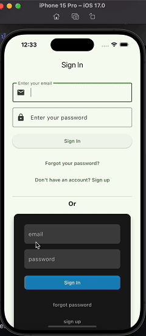

# flutter-auth-ui :iphone:

<p float="left">

</p>
A simple library of predefined widgets to easily and quickly create auth components using Flutter and Supabase.


## Email Auth

Use a `SupaEmailAuth` widget to create an email and password signin/ signup form.
It also contains a button to toggle to display a forgot password form.

You can pass `metadataFields` to add additional fields to the signup form to pass as metadata to Supabase.

You need to setup deep links in your app to if you have enabled email confirmation. Learn more about deep links on the [supabase_flutter README](https://pub.dev/packages/supabase_flutter#deep-links).

```dart
// Create a Email sign-in/sign-up form
SupaEmailAuth(
  redirectTo: kIsWeb ? null : 'io.mydomain.myapp://callback',
  onSignInComplete: (response) {
    // do something, for example: navigate('home');
  },
  onSignUpComplete: (response) {
    // do something, for example: navigate("wait_for_email");
  },
  metadataFields: [
    // Creates an additional TextField for string metadata, for example:
    // {'username': 'exampleUsername'}
    MetaDataField(
      prefixIcon: const Icon(Icons.person),
      label: 'Username',
      key: 'username',
      validator: (val) {
        if (val == null || val.isEmpty) {
          return 'Please enter something';
        }
        return null;
      },
    ),

    // Creates a CheckboxListTile for boolean metadata, for example:
    // {'marketing_consent': true}
    BooleanMetaDataField(
      label: 'I wish to receive marketing emails',
      key: 'marketing_consent',
      checkboxPosition: ListTileControlAffinity.leading,
    ),
    // Supports interactive text. Fields can be marked as required, blocking form
    // submission unless the checkbox is checked.
    BooleanMetaDataField(
      key: 'terms_agreement',
      isRequired: true,
      checkboxPosition: ListTileControlAffinity.leading,
      richLabelSpans: [
        const TextSpan(
            text: 'I have read and agree to the '),
        TextSpan(
          text: 'Terms and Conditions',
          style: const TextStyle(
            color: Colors.blue,
          ),
          recognizer: TapGestureRecognizer()
            ..onTap = () {
              // do something, for example: navigate("terms_and_conditions");
            },
        ),
        // Or use some other custom widget.
        WidgetSpan()
      ],
    ),
  ]),
```

## Magic Link Auth

Use `SupaMagicAuth` widget to create a magic link signIn form. You need to setup deep links in your app to use magic link. Learn more about deep links on the [supabase_flutter README](https://pub.dev/packages/supabase_flutter#deep-links).

```dart
SupaMagicAuth(
  redirectUrl: kIsWeb ? null : 'io.supabase.flutter://reset-callback/',
  onSuccess: (Session response) {
    // do something, for example: navigate('home');
  },
  onError: (error) {
    // do something, for example: navigate("wait_for_email");
  },
),
```

## Reset password

Use `SupaResetPassword` to create a password reset form.

```dart
SupaResetPassword(
  accessToken: supabase.auth.currentSession?.accessToken,
  onSuccess: (UserResponse response) {
    // do something, for example: navigate('home');
  },
  onError: (error) {
    // do something, for example: navigate("wait_for_email");
  },
),
```

## Social Auth

Use `SupaSocialsAuth` to create list of social login buttons. You need to setup deep links in your app to use social auth. Learn more about deep links on the [supabase_flutter README](https://pub.dev/packages/supabase_flutter#deep-links).

```dart
SupaSocialsAuth(
    socialProviders: [
        OAuthProvider.apple,
        OAuthProvider.google,
    ],
    colored: true,
    redirectUrl: kIsWeb
          ? null
          : 'io.supabase.flutter://reset-callback/',
    onSuccess: (Session response) {
        // do something, for example: navigate('home');
    },
    onError: (error) {
        // do something, for example: navigate("wait_for_email");
    },
),
```

## SupaAvatar

A plug-and-play widget to show and edit a Supabase user's profile image. 
Supports both readonly and editable modes with full customization options.

<!-- demo gif here -->


### Usage

```dart
import 'package:supabase_auth_ui/supabase_auth_ui.dart';

class ProfileScreen extends StatelessWidget {
  const ProfileScreen({super.key});

  @override
  Widget build(BuildContext context) {
    return Center(
      child: SupaAvatar(
        radius: 50,
        isEditable: true,
      ),
    );
  }
}
```

### Customization

```dart
SupaAvatar(
  radius: 60,
  isEditable: true,
  supabaseStorageBucket: 'avatars',
  supabaseStoragePath: 'profile_image', // stored as userId/profile_image
  supabaseUserAttributeImageUrlKey: 'avatar_url',

  fallbackIcon: Icon(Icons.person_2_rounded, size: 32),
  cacheBuster: DateTime.now().millisecondsSinceEpoch.toString(),

  // editor customization
  editorType: SupaAvatarEditorType.dialog, // defaults to SupaAvatarEditorType.modal
  editorShape: RoundedRectangleBorder(
    borderRadius: BorderRadius.vertical(top: Radius.circular(20)),
  ),
  editorBackgroundColor: Colors.grey[900],

  // Snackbar colors
  snackBarBackgroundColor: Colors.green[600],
  snackBarTextColor: Colors.white,
  snackBarErrorBackgroundColor: Colors.red[600],
  snackBarErrorTextColor: Colors.white,
  snackBarDuration: Duration(seconds: 2),
)
```


### Notes

- The image is stored in `avatars/{userId}/{supabaseStoragePath}`.
- The metadata field (`avatar_url` by default) is updated on upload/remove.
- Uses `cacheBuster` to bypass CDN cache after upload.
- Tapping on avatar opens a bottom sheet or dialog for edit options when `isEditable` is true.

---

## Theming

This library uses bare Flutter components so that you can control the appearance of the components using your own theme.
See theme example in example/lib/sign_in.dart
